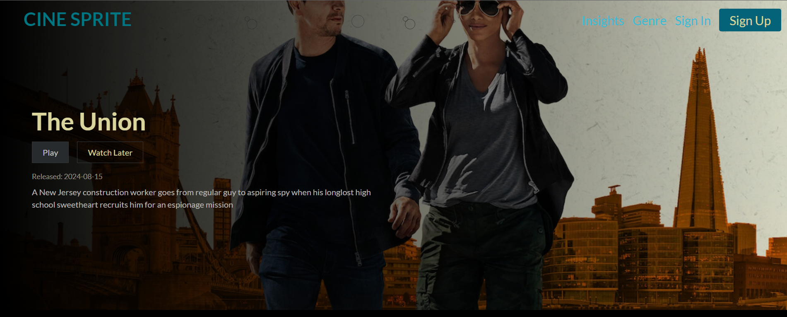
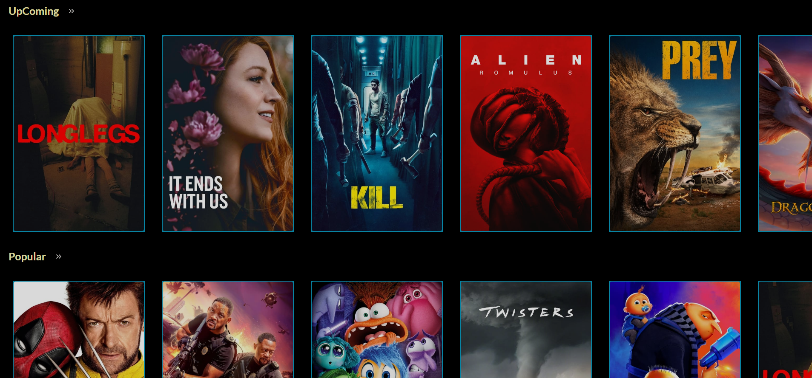
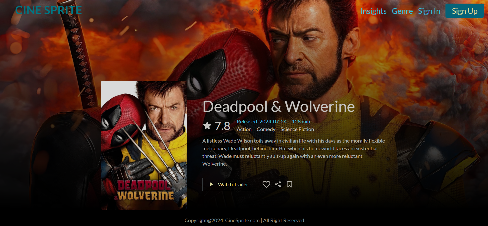
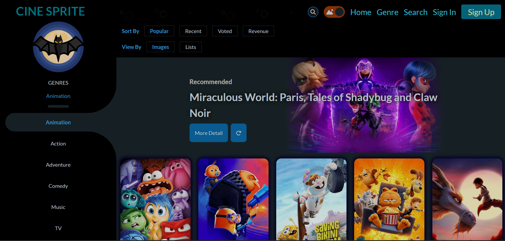
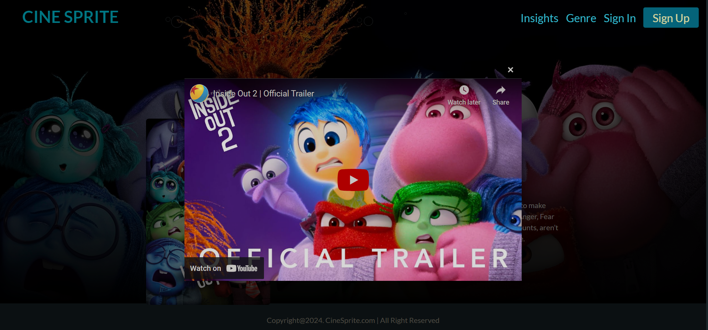
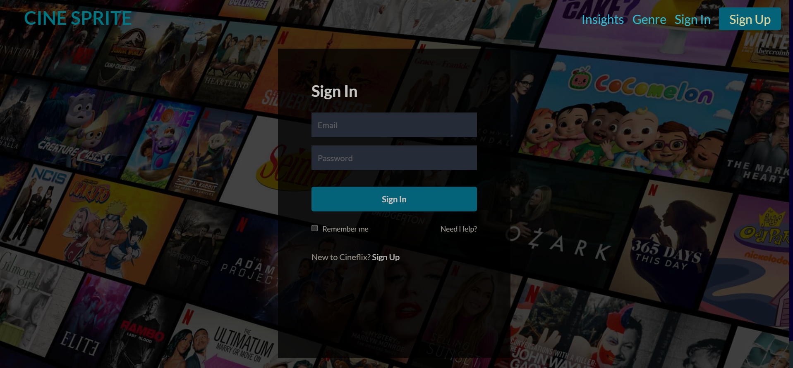
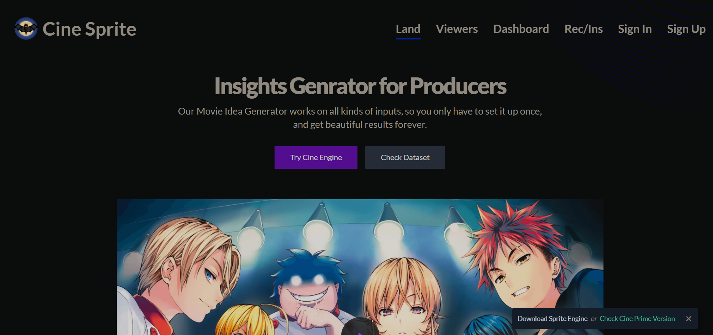

# Cine_Sprite_Genre

This is a site (or a component of the project Cine Sprite) which provides simple yet pleasing interface with filters of genre selection and many more.
Developed by Pirate-Emperor, Cine_Sprite_Genre is a web application inspired by Netflix, but with a specific focus on movie genre selection. The project is built using ReactJS to offer users a tailored experience for exploring movies across various genres.

## Features

- **Genre-Based Filtering**: Allows users to filter movies based on genres, providing a personalized selection of movies to explore.
- **Responsive Design**: Adapts to various screen sizes and devices, ensuring a seamless user experience.
- **Movie Details**: Displays detailed information about each movie, including title, description, release date, and ratings.
- **User Favorites**: Lets users mark their favorite movies, creating a personalized list for easy access.
- **Search Functionality**: Enables users to search for movies based on keywords, titles, or genres.
- **Recommendations**: Suggests movies based on users' viewing history and preferences.

## Screenshots
### Slope








# Importance of Movie Genres
Movie genres are important for a variety of reasons, both for filmmakers and for audiences:

1. **Audience Expectations**: Genres help set audience expectations. When a movie is classified into a genre, it gives viewers an idea of what they can expect in terms of plot, style, and mood. For instance, a horror film is likely to have suspenseful music, dark lighting, and frightening scenes, while a romantic comedy might have light-hearted dialogue and a happy ending.

2. **Marketing**: Genres are essential for marketing and promoting movies. They help studios and distributors target their promotional efforts to the right audiences. For example, a family movie will be marketed differently than a horror film.

3. **Film Criticism and Analysis**: Genres are used in film criticism and analysis to categorize and evaluate films. They provide a framework for discussing and comparing movies, and for understanding trends and patterns in film history.

4. **Creative Direction**: For filmmakers, genres can provide a creative framework and set of conventions to work within. They can choose to adhere to these conventions, subvert them, or blend elements from different genres to create something new.

5. **Streaming and Recommendation Systems**: On streaming platforms, genres are used to organize content and make recommendations. For example, if you watch a lot of comedies, the platform might recommend other comedies that you might enjoy.

6. **Cultural Understanding**: Genres often reflect cultural attitudes, fears, and desires. For example, the popularity of dystopian films might reflect societal anxieties about the future, while the prevalence of superhero movies might reflect a desire for heroes and moral clarity.

Overall, movie genres play a crucial role in how films are made, how they are marketed and consumed, and how they are analyzed and understood.

## Prerequisites

To run the project, you'll need:

- Node.js
- npm (Node Package Manager)

## Installation

Clone the repository and navigate to the project directory:

```bash
git clone https://github.com/Pirate-Emperor/Cine_Sprite_Genre.git
cd Cine_Sprite_Genre
```

Install the required dependencies:

```bash
npm install
```

## Usage

Start the development server:

```bash
npm start
```

The application will be accessible at `http://localhost:3000/`.

## Data Source

The project uses a movie database API to fetch movie data, including genres, titles, descriptions, release dates, and ratings. You can replace the API with another movie database or your own data source.

## Development

To enhance the project, you can modify the React components in the `src` directory. Some potential areas for improvement include:

- Implementing user authentication and profiles.
- Adding more advanced filtering and sorting options for movies.
- Incorporating a backend server for user data persistence and recommendations.
- Expanding the application to include TV shows and series.

## License

This project is licensed under the MIT License - see the [LICENSE.md](LICENSE.md) file for details.
